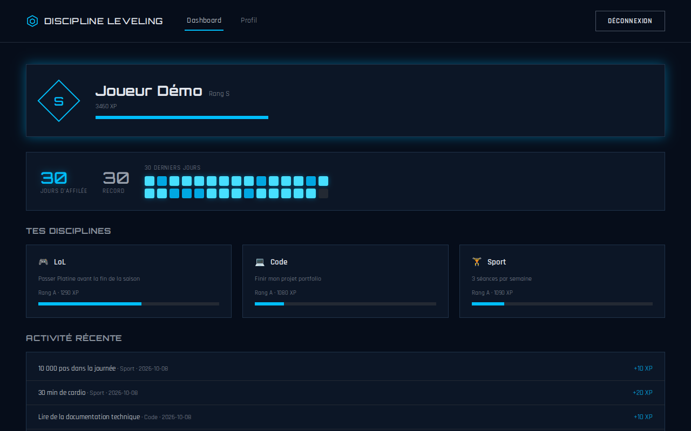
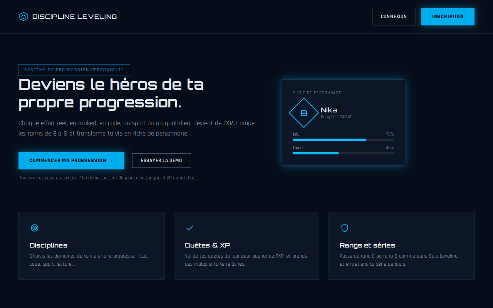
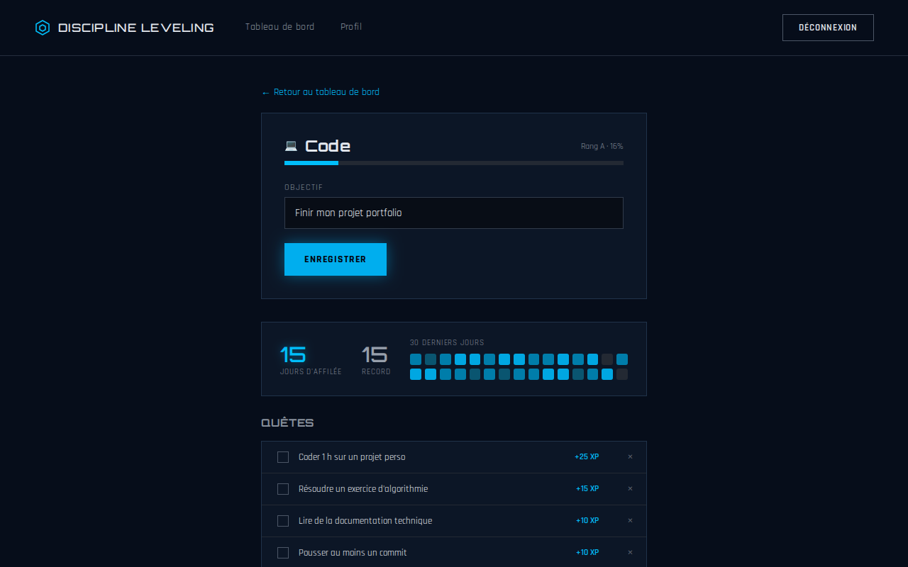
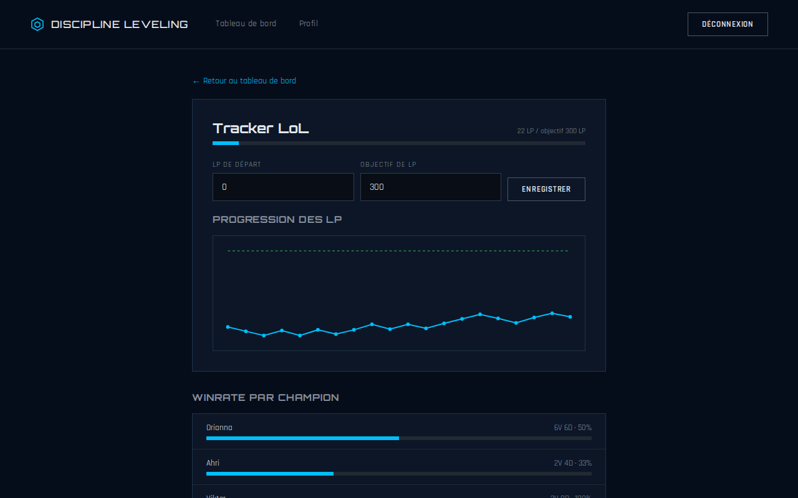

# Discipline Leveling

[](https://github.com/NIKAerer/Discipline-Leveling/actions/workflows/ci.yml)

Une application web qui transforme tes efforts du quotidien en progression de jeu vidéo, dans l'esprit de *Solo Leveling*. Tu choisis des disciplines (League of Legends, code, sport, lecture…), tu valides des quêtes chaque jour, tu gagnes de l'XP et tu montes de rang, de E à S.

Projet personnel réalisé par **Nika**, développeur web junior (BTS SIO SLAM).



## Essayer la démo

**Démo en ligne : [discipline-leveling.vercel.app](https://discipline-leveling.vercel.app)**

Sur la page d'accueil, le bouton **« Essayer la démo »** remplit le formulaire de connexion avec ce compte :

| Email | Mot de passe |
|---|---|
| `demo@discipline-leveling.fr` | `Demo1234!` |

Le compte contient 30 jours d'historique et 20 parties de LoL. Il est en lecture seule pour le profil (impossible de le supprimer ou de changer son email) et il est recréé à chaque redémarrage du serveur.

> La démo est hébergée sur des offres gratuites : si personne ne l'a utilisée depuis un moment, la première connexion peut prendre jusqu'à une minute, le temps que l'API se réveille.

## Fonctionnalités

- **Compte** : inscription, connexion par token JWT, déconnexion automatique quand le token expire, modification et suppression du profil.
- **Disciplines** : on en choisit plusieurs à l'inscription, avec un objectif pour chacune, et on peut en ajouter plus tard.
- **Quêtes et malus** : des quêtes proposées par discipline, ou des quêtes personnalisées. Une quête validée rapporte de l'XP, un malus en retire. On peut annuler une validation le jour même.
- **Rangs** : chaque discipline a son rang, et le joueur a un rang global (E à S, selon l'XP cumulée).
- **Historique** : série de jours d'affilée, record, carte d'activité sur 30 jours et dernières quêtes validées.
- **Tracker LoL** : saisie des parties (champion, victoire ou défaite, LP gagnés ou perdus), courbe des LP vers un objectif et winrate par champion.

| Accueil | Discipline | Tracker LoL |
|---|---|---|
|  |  |  |

## Stack technique

| Partie | Technologies |
|---|---|
| API | PHP 8.4, Symfony 8.1, Doctrine ORM, SQLite, LexikJWTAuthenticationBundle, NelmioCorsBundle |
| Front | React 19, Vite, React Router 7, CSS sans framework |
| Tests | PHPUnit (unitaires et fonctionnels), Vitest + Testing Library, Playwright (bout en bout) |
| Outillage | GitHub Actions, Docker (FrankenPHP), Render pour l'API, Vercel pour le front |

## Installation en local

Prérequis : PHP 8.4 avec `pdo_sqlite`, Composer, Node.js 22.

```bash
# API (http://localhost:8000)
cd api
composer install
composer setup        # clés JWT, base SQLite, disciplines et compte de démo
php -S localhost:8000 -t public

# Front (http://localhost:5173), dans un second terminal
cd app
npm install
npm run dev
```

`composer setup` peut être relancé à tout moment : il remet le compte de démo à zéro. Les secrets locaux (`APP_SECRET`, `JWT_PASSPHRASE`) se mettent dans `api/.env.local`, qui n'est pas versionné.

## Tests

```bash
cd api && composer test     # PHPUnit : 8 fichiers de tests, base SQLite dédiée
cd app && npm test          # Vitest : composants et utilitaires
cd app && npm run test:e2e  # Playwright : parcours complet dans un navigateur
```

La CI GitHub Actions lance à chaque pull request :

1. les tests PHPUnit et la vérification que le schéma Doctrine correspond aux migrations ;
2. le lint, les tests et le build du front ;
3. le parcours Playwright sur la vraie API et le vrai front, qui génère aussi les captures de ce README ;
4. la construction de l'image Docker de production, avec un test de connexion au compte de démo.

## Organisation du code

```
api/                    API Symfony
  src/Controller/       un contrôleur par ressource (quêtes, historique, LoL…)
  src/Service/          logique métier testée seule (rangs, séries, suppression de compte)
  src/Command/          app:seed, qui crée les disciplines et le compte de démo
  src/Http/JsonBody.php lecture et validation du corps JSON des requêtes
  docker/               configuration de l'image de production
app/                    front React
  src/pages/            une page par écran
  src/components/       composants réutilisables (carte d'activité, modale de connexion…)
  src/utils/api.js      client HTTP unique : token, erreurs, expiration de session
  e2e/                  tests Playwright
docs/screenshots/       captures générées par la CI
```

## Choix techniques

- **SQLite** plutôt que MySQL : aucune base à installer pour tester le projet, et largement suffisant pour une démo.
- **Token JWT sans état** : le front React et l'API sont séparés et déployés sur deux hébergeurs, sans session partagée.
- **Un seul client HTTP côté front** (`apiFetch`) : il ajoute le token, et renvoie vers l'accueil si la session a expiré, au lieu de répéter ce code dans chaque page.
- **La logique métier dans des services** (`RankCalculator`, `StreakCalculator`) : elle se teste sans base ni HTTP.
- **Les erreurs de l'API en JSON** (`{"error": "..."}`) et en français, pour que le front puisse les afficher telles quelles.

## Limites connues

- Pas de réinitialisation de mot de passe ni de vérification d'email.
- Les parties de LoL se saisissent à la main : pas d'import depuis l'API Riot.
- Un token expire au bout d'une heure, sans renouvellement automatique : il faut se reconnecter.
- Sur la démo en ligne, les données sont effacées à chaque redémarrage du serveur.

## Pistes pour la suite

- Import automatique des parties via l'API Riot.
- Rappels quotidiens et application installable (PWA).
- Passage à PostgreSQL avec un stockage persistant pour la démo.
